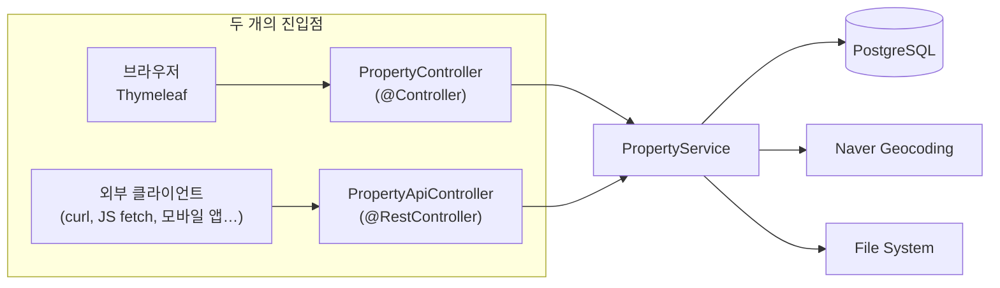
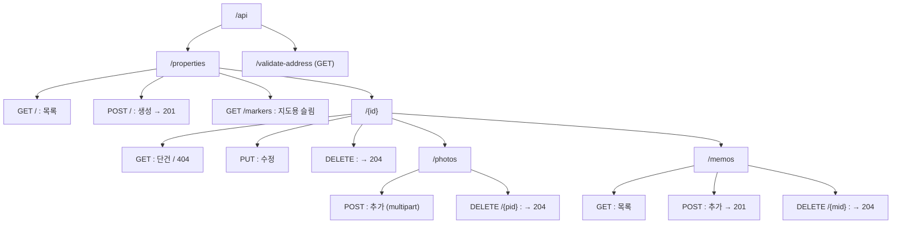
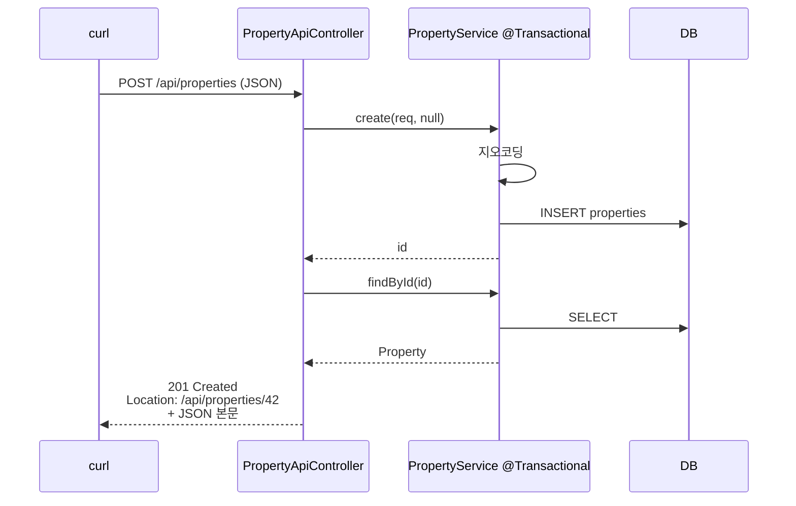

# RESTful API 확장 회고

> [!summary] 한 줄 요약
> 기존 단편적인 `/api` 엔드포인트(주소 검증, 지도 마커)에 더해, 매물·사진·메모를 **RESTful 표준 CRUD**로 확장하고, 응답을 **DTO로 캡슐화**했으며, 예외를 **`@RestControllerAdvice`로 일원화**했다. 결과적으로 같은 비즈니스 로직(`PropertyService`)이 MVC와 REST 두 진입점을 모두 자연스럽게 지탱한다.

---

## 🎯 왜 했나

[[SERVICE_LAYER_NOTE]]에서 분리한 Service 계층 위에, **외부 진입점을 하나 더** 얹는 단계. 이제 두 가지 흐름이 동시에 존재한다:



> [!tip] 학습 포인트
> **Service 분리가 먼저, REST 확장이 나중인 이유**가 이 그림에 다 있다. 두 컨트롤러가 같은 Service를 호출하므로, 비즈니스 로직은 한 군데에만 존재한다. Service 분리를 안 했다면 같은 65줄짜리 메서드가 두 컨트롤러에 복붙됐을 거다.

---

## 🧱 RESTful 설계 원칙 — 이번에 지킨 것

### 1. URL은 명사(자원), 동작은 HTTP 메서드

| ❌ 비-RESTful | ✅ RESTful |
| --- | --- |
| `POST /api/createProperty` | `POST /api/properties` |
| `GET /api/getProperty?id=1` | `GET /api/properties/1` |
| `POST /api/deleteProperty?id=1` | `DELETE /api/properties/1` |

> [!info] 왜 명사가 되어야 하나?
> "동작"은 이미 HTTP 메서드(GET/POST/PUT/DELETE)에 들어있다. URL에 동사를 또 박으면 정보가 중복되고, 같은 자원에 대한 작업이 여러 URL로 흩어진다. **자원 = URL, 행위 = HTTP 메서드**가 표준 모델.

### 2. 자원은 계층 구조로 표현

매물의 사진은 매물의 "서브 자원". URL이 그 관계를 그대로 보여준다:

```
/api/properties                    ← 매물 컬렉션
/api/properties/{id}               ← 매물 한 건
/api/properties/{id}/photos        ← 그 매물의 사진들
/api/properties/{id}/photos/{pid}  ← 그중 한 장
/api/properties/{id}/memos         ← 그 매물의 메모들
/api/properties/{id}/memos/{mid}   ← 그중 한 건
```

### 3. HTTP 상태 코드를 의미 있게 사용

| 코드 | 의미 | 사용한 곳 |
| --- | --- | --- |
| `200 OK` | 조회/수정 성공 | GET, PUT |
| `201 Created` | 자원 생성됨 + `Location` 헤더 | POST 생성 |
| `204 No Content` | 성공했지만 본문 없음 | DELETE |
| `400 Bad Request` | 입력값 오류 | 검증 실패 |
| `404 Not Found` | 자원 없음 | "not found" 예외 |
| `500 Internal Server Error` | 서버 오류 | 그 외 |

> [!example] 201 + Location 헤더
> ```http
> HTTP/1.1 201 Created
> Location: /api/properties/42
> Content-Type: application/json
>
> { "id": 42, "title": "...", ... }
> ```
> 클라이언트는 응답 헤더의 `Location`을 바로 후속 요청에 쓸 수 있다.

### 4. 응답 본문 형식의 일관성

모든 에러는 같은 모양의 JSON으로 나간다.

```json
{
  "timestamp": "2026-05-19T08:00:00Z",
  "status": 404,
  "error": "Not Found",
  "message": "Property not found : 999"
}
```

---

## 🗂️ 완성된 엔드포인트 카탈로그



| 메서드 | URL | 응답 | 의미 |
| --- | --- | --- | --- |
| `GET` | `/api/properties` | 200, 목록 | 풀 DTO |
| `GET` | `/api/properties/{id}` | 200 / 404 | 단건 |
| `POST` | `/api/properties` | 201 + Location | JSON 생성 |
| `PUT` | `/api/properties/{id}` | 200 | 수정 |
| `DELETE` | `/api/properties/{id}` | 204 | 삭제 |
| `GET` | `/api/properties/markers` | 200, 슬림 | 지도용 |
| `POST` | `/api/properties/{id}/photos` | 200 | multipart 사진 추가 |
| `DELETE` | `/api/properties/{pid}/photos/{photoId}` | 204 | 사진 삭제 |
| `GET` | `/api/properties/{id}/memos` | 200 | 메모 목록 |
| `POST` | `/api/properties/{id}/memos` | 201 | 메모 추가 |
| `DELETE` | `/api/properties/{pid}/memos/{memoId}` | 204 | 메모 삭제 |
| `GET` | `/api/validate-address` | 200 | 지오코딩 검증 |

---

## 📦 새로 만든 / 바뀐 파일

| 파일 | 변화 |
| --- | --- |
| `controller/dto/PropertyResponse.java` | **신규** — 매물 응답 DTO (만원 단위, 사진 포함) |
| `controller/dto/PropertyResponse.PhotoResponse` | **신규** — 사진 응답 DTO (내부 record) |
| `controller/dto/MemoResponse.java` | **신규** — 메모 응답 DTO (역참조 차단) |
| `controller/ApiExceptionHandler.java` | **신규** — 전역 예외 → JSON 변환 |
| `controller/PropertyApiController.java` | CRUD + 사진/메모 서브 자원 엔드포인트 확장 |
| `static/js/map.js` | markers 엔드포인트 이동에 따른 fetch URL 갱신 |

---

## 💡 디자인 결정과 그 이유

### 결정 1: 엔티티를 직접 반환하지 않고 Response DTO를 도입

```java
// 안 한 방식 (위험)
@GetMapping("/api/properties/{id}")
public Property get(@PathVariable Long id) {
    return propertyService.findById(id);   // ← 엔티티 직접 노출
}

// 한 방식 (안전)
@GetMapping("/api/properties/{id}")
public PropertyResponse get(@PathVariable Long id) {
    return PropertyResponse.from(propertyService.findById(id));
}
```

> [!warning] 엔티티 직접 노출의 3가지 문제
> 1. **민감 정보 자동 노출** — `entrancePassword`, `housePassword`가 그대로 JSON에 박힘. `@JsonIgnore`를 일일이 붙여도 잊어버리기 쉬움.
> 2. **N+1 폭발** — `photos`, `memos` 같은 lazy 컬렉션이 직렬화 시점에 펼쳐지면서 추가 쿼리가 터짐.
> 3. **순환 참조 무한 루프** — `Property → Memos → Property → Memos → ...`로 Jackson이 무한 루프에 빠짐. `@JsonManagedReference/@JsonBackReference` 같은 우회책이 필요.

DTO는 이 세 가지를 **한 번에 해결**한다. "**어떤 필드를 노출할지**"가 코드에 명시적으로 드러나기 때문.

### 결정 2: 사진 업로드를 별도 엔드포인트로 분리

**한 번에 multipart로 보내는 방식 (안 함):**
```
POST /api/properties
Content-Type: multipart/form-data
- property (JSON 파트)
- photos[] (파일 파트들)
```

**분리한 방식 (함):**
```
POST /api/properties              ← 매물만 JSON으로
POST /api/properties/{id}/photos  ← 그 매물에 사진 별도 추가
```

> [!tip] 왜 분리?
> - **자원의 독립성**: 매물과 사진은 서로 다른 자원. URL이 그 관계를 표현해야 함.
> - **사진 없이 매물만 만드는 시나리오**가 더 흔함. 한 번에 합치면 빈 multipart로 보내는 어색한 패턴이 강제됨.
> - **사진 N장 모두 성공/실패**의 트랜잭션 결합도가 낮아짐. 한 장 실패가 매물 자체 생성을 막지 않는다.

### 결정 3: `@RestControllerAdvice(annotations = RestController.class)`로 범위 한정

```java
@RestControllerAdvice(annotations = RestController.class)
public class ApiExceptionHandler { ... }
```

> [!bug] 범위 한정이 없으면?
> 기본 `@RestControllerAdvice`는 **모든 컨트롤러**(MVC 포함)에 적용된다. 그러면 `PropertyController`의 `IllegalArgumentException`도 JSON으로 응답되어 — Thymeleaf view 렌더링이 깨진다.
>
> `annotations = RestController.class`로 한정하면 `@RestController`가 붙은 컨트롤러에만 적용된다. MVC는 자기 try-catch + view 분기를 그대로 사용한다.

### 결정 4: markers 엔드포인트를 `/api/properties` → `/api/properties/markers`로 이동

기존:
```
GET /api/properties?id=1        ← 마커 단건
GET /api/properties?keyword=... ← 마커 목록
```

→ 새 표준 CRUD `GET /api/properties`(풀 DTO 목록)와 충돌.

해결:
```
GET /api/properties              ← 표준 목록 (풀 DTO)
GET /api/properties/markers      ← 지도용 슬림 DTO
```

> [!info] 의미 분리
> 같은 데이터(매물)지만 **표현 형태가 다른** 두 응답이 필요할 때, URL을 분리하는 게 일반적이다. 다른 방법으로는 `Accept` 헤더로 분기하거나 query parameter(`?view=marker`)로 분기할 수도 있다. 학습 단계에서는 URL 분리가 가장 직관적.

### 결정 5: "Not Found"를 메시지로 판별하여 404로 변환

```java
@ExceptionHandler(IllegalArgumentException.class)
public ResponseEntity<Map<String, Object>> handleIllegalArgument(IllegalArgumentException e) {
    String msg = e.getMessage();
    boolean notFound = msg.toLowerCase().contains("not found");
    HttpStatus status = notFound ? HttpStatus.NOT_FOUND : HttpStatus.BAD_REQUEST;
    ...
}
```

> [!warning] 문자열 매칭의 한계
> 이건 **임시방편**이다. 진짜 해법은 도메인 전용 예외를 도입하는 것:
> ```java
> public class PropertyNotFoundException extends RuntimeException { ... }
> ```
> 그리고 Service에서 `throw new PropertyNotFoundException(id)`로 던지면, 핸들러에서 그 타입을 직접 잡을 수 있다. 9단계 즈음에 정비할 항목.

---

## 🔄 트랜잭션 관점에서 본 흐름

REST API 호출도 결국 같은 `@Transactional` Service를 거친다. 이전 [[SERVICE_LAYER_NOTE]]의 흐름이 그대로 적용된다.



---

## ⚠️ 알아둘 한계

### 1. PUT의 의미가 부정확
표준 REST에서 `PUT`은 **자원 전체 교체** (보내지 않은 필드는 null이 되어야 함). 부분 수정은 `PATCH`가 정확하다. 우리 `updateAll(req)`는 모든 필드를 받는 구조라 부분 수정이 어색하다. → 7단계 Validation 도입 시 같이 정비 권장.

### 2. Validation이 아직 없음
`@RequestBody PropertyCreateRequest`에 `@Valid`가 없고, DTO에 `@NotBlank` 같은 어노테이션도 없다. 빈 title이나 음수 보증금도 일단 받아들임. → 7단계.

### 3. 페이징 미지원
`GET /api/properties`가 모든 매물을 한꺼번에 반환한다. 매물이 10만 건이 되면 즉시 죽는다. 추가해야 할 항목:
```java
@GetMapping("/properties")
public Page<PropertyResponse> list(..., @PageableDefault Pageable pageable) {
    return propertyService.findAll(spec, pageable).map(PropertyResponse::from);
}
```

### 4. 인증/인가 부재 — **운영 배포 절대 금지**
누구나 `DELETE /api/properties/1`을 보낼 수 있다. 평문 비밀번호 필드까지 GET 응답에 그대로 노출된다. → [[SPRING_SECURITY_NOTE|5단계]] 완료 후에만 배포 가능.

### 5. API 버전 관리 부재
지금은 `/api/properties`. 나중에 응답 형태가 바뀌면 기존 클라이언트가 깨진다. 운영 API는 보통 `/api/v1/properties`처럼 버전을 박는다.

---

## 🧪 curl 검증 스니펫

이번 작업이 끝난 뒤 실제로 돌려본 명령들.

```bash
# 목록
curl http://localhost:8080/api/properties | jq

# 단건 — 없는 ID는 404
curl -i http://localhost:8080/api/properties/9999
# → HTTP/1.1 404 Not Found
# → { "status": 404, "error": "Not Found", "message": "Property not found : 9999" }

# 생성
curl -i -X POST http://localhost:8080/api/properties \
  -H "Content-Type: application/json" \
  -d '{"title":"테스트","lotAddress":"서울특별시 중구 세종대로 110","dealType":"MONTHLY","deposit":1000,"monthlyRent":50}'
# → HTTP/1.1 201 Created
# → Location: /api/properties/42

# 삭제
curl -i -X DELETE http://localhost:8080/api/properties/42
# → HTTP/1.1 204 No Content
```

---

## 🚀 이 작업이 가능하게 한 것

이제 외부 시스템이 이 매물 시스템과 통합할 수 있다:

- **모바일 앱**: iOS/Android에서 같은 JSON API 사용
- **Postman / Insomnia**: API 문서화 및 테스트
- **Swagger/OpenAPI**: 자동 문서화 도구 적용 가능 (springdoc-openapi)
- **다른 서비스에서 호출**: 메일 발송 서버, 알림 서버 등이 매물 데이터를 직접 가져갈 수 있음

다음 단계인 Spring Security가 도입되면, 이 API에 **JWT 토큰 발급/검증**을 얹어서 외부 인증된 클라이언트만 접근하게 만들 수 있다.

---

## ✅ 검증 체크리스트

- [x] `GET /api/properties` 응답이 풀 DTO로 나옴
- [x] `GET /api/properties/9999` → 404 + 표준 에러 JSON
- [x] `POST /api/properties` → 201 + Location 헤더
- [x] `DELETE /api/properties/{id}` → 204
- [x] map.js에서 마커 fetch가 새 URL로 동작 (`/markers`)
- [x] MVC 화면(`/properties`)이 여전히 view를 정상 렌더링 (예외 핸들러에 안 잡힘)
- [ ] 사진 multipart 업로드 테스트
- [ ] 메모 추가 테스트

---

## 📚 더 공부할 거리

- [[REST 아키텍처와 Roy Fielding의 논문]]
- [[HATEOAS와 진정한 RESTful 수준]]
- [[OpenAPI/Swagger로 API 문서화]]
- [[PUT vs PATCH 의미적 차이]]
- [[JSON 직렬화 사이드 이펙트 (Jackson)]]
- [[API 버전 관리 전략]]
- [[CORS와 같은 출처 정책]]

---

## 🔗 관련 노트

- [[REVIEW]] — 이 작업이 해결한 문제 4-1 항목
- [[SERVICE_LAYER_NOTE]] — 이 작업의 토대가 된 직전 단계
- [[ENV_SETUP]] — 운영 배포 시 환경변수
- [[Roadmap]] — 다음은 #5 Spring Security

---

> [!quote] 회고
> RESTful API는 단순히 "JSON으로 응답하는 컨트롤러"가 아니다.
> **URL이 자원을 표현**하고, **메서드가 행위를 표현**하고, **상태 코드가 결과를 표현**하는 — 일관된 약속이다.
> 이 약속을 지키면 클라이언트가 한 번만 배워서 우리 API 전체를 다룰 수 있다. 안 지키면 엔드포인트마다 매뉴얼이 필요해진다.
