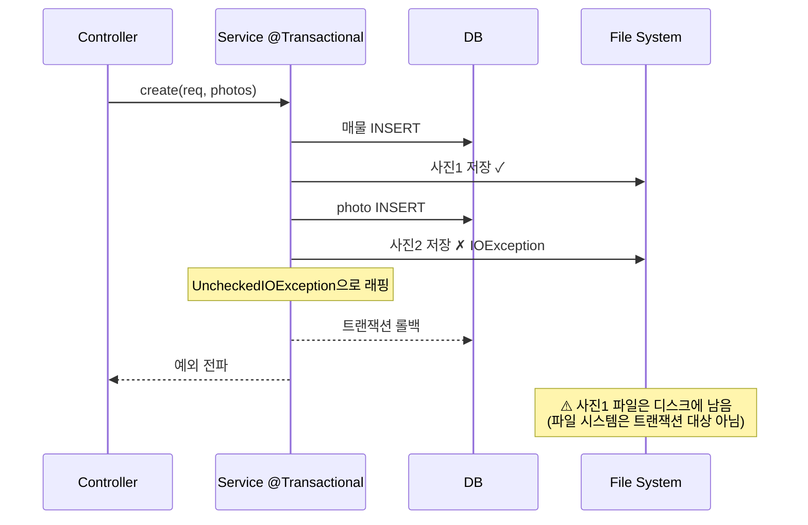
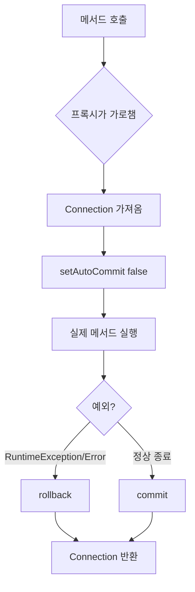

# Service 계층 분리 회고

> [!summary] 한 줄 요약
> 컨트롤러에 흩어져 있던 비즈니스 로직을 `PropertyService` 한 곳으로 모으고, 트랜잭션 경계를 명시했다. 결과적으로 컨트롤러는 절반(378 → 196줄)으로 줄었고, MVC와 REST가 같은 로직을 공유할 토대가 생겼다.

---

## 🎯 왜 했나

[[REVIEW]] 4-1 항목에서 지적한 문제 — `PropertyController.create()` 한 메서드 안에 **검증 + 외부 API 호출 + 엔티티 생성 + DB 저장 + 파일 업로드 + 예외 처리**가 65줄로 뒤엉켜 있었다.

이걸 그대로 두고 REST API를 추가하면 **같은 로직을 한 번 더 복붙**해야 하고, 그 순간부터 코드가 두 군데에서 동시에 썩기 시작한다.

> [!tip] 학습 포인트
> "**같은 비즈니스 로직을 여러 진입점(MVC, REST, 배치, 스케줄러…)에서 공유해야 할 때**" — 그게 Service 계층의 존재 이유. 단순히 "패키지 하나 더 만들자"가 아니다.

---

## 📐 Before & After

### 구조 다이어그램

```mermaid
flowchart LR
    subgraph Before
        A1[PropertyController<br/>378줄] --> R1[(Repository)]
        A1 --> G1[Naver API]
        A1 --> F1[File System]
        A2[PropertyApiController] --> R1
        A2 --> G1
    end

    subgraph After
        B1[PropertyController<br/>196줄] --> S[PropertyService<br/>@Transactional]
        B2[PropertyApiController] --> S
        S --> R2[(Repository)]
        S --> G2[Naver API]
        S --> F2[File System]
    end
```

### 코드 비교 — `create` 흐름

**Before (Controller가 다 함):**
```java
@PostMapping
public String create(@ModelAttribute PropertyCreateRequest request,
                     @RequestParam List<MultipartFile> photos,
                     Model model) {
    try {
        if (request.getLotAddress() == null || ...) throw new ...;
        var point = naverGeocodingClient.geocodeOrThrow(...);
        Property property = new Property();
        property.updateAll(request);
        property.updateLocation(point.lat(), point.lng());
        propertyRepository.save(property);
        // 사진 루프 17줄...
        return "redirect:/properties/" + property.getId();
    } catch (Exception e) {
        // 폼 재렌더 분기 12줄...
    }
}
```

**After (Controller는 위임):**
```java
@PostMapping
public String create(@ModelAttribute PropertyCreateRequest request,
                     @RequestParam List<MultipartFile> photos,
                     Model model) {
    try {
        Long id = propertyService.create(request, photos);
        return "redirect:/properties/" + id;
    } catch (Exception e) {
        return renderFormWithError("properties/new", e, request, model);
    }
}
```

---

## 🧱 새로 생긴 / 바뀐 파일

| 파일 | 변화 |
| --- | --- |
| `service/PropertyService.java` | **신규** — 비즈니스 로직 집합소 |
| `controller/PropertyController.java` | 378줄 → 196줄, 얇은 layer로 다이어트 |
| `controller/PropertyApiController.java` | Repository 직접 참조 제거 → Service 위임 |
| `controller/dto/PropertyCreateRequest.java` | `from(Property)` 정적 팩토리 추가 |

---

## 🧠 PropertyService 구조 상세

### 의존성 5개

```java
@Service
@Transactional(readOnly = true)
public class PropertyService {
    private final PropertyRepository propertyRepository;
    private final PropertyPhotoRepository propertyPhotoRepository;
    private final MemoRepository memoRepository;
    private final NaverGeocodingClient naverGeocodingClient;
    private final FileStorageService fileStorageService;
}
```

생성자 주입(constructor injection) 사용. `@Autowired` 필드 주입이 아닌 이유 → **불변성** + **테스트 용이성** + **순환 의존성 즉시 발견**.

### 메서드 카탈로그

| 메서드 | 트랜잭션 | 책임 |
| --- | --- | --- |
| `create(req, photos)` | 쓰기 | 검증 → 지오코딩 → 매물·사진 저장 |
| `update(id, req, photos)` | 쓰기 | 주소 변경 시만 재지오코딩, 사진 추가 |
| `delete(id)` | 쓰기 | 디스크 파일 정리 + DB 삭제 |
| `findById(id)` | 읽기 | 없으면 IllegalArgumentException |
| `findAll(spec)` | 읽기 | 목록 조회 |
| `findAll(spec, pageable)` | 읽기 | 페이징 조회 (지도 마커용) |
| `addMemo(propertyId, content)` | 쓰기 | 양방향 연관관계 동기화 |
| `deleteMemo(propertyId, memoId)` | 쓰기 | 소유권 검증 후 삭제 |
| `findMemosByProperty(id)` | 읽기 | 최신순 |
| `deletePhoto(propertyId, photoId)` | 쓰기 | 소유권 검증 + 디스크 파일 정리 |

---

## 💡 디자인 결정과 그 이유

### 결정 1: 클래스 레벨 `@Transactional(readOnly = true)` + 쓰기 메서드만 `@Transactional`

```java
@Service
@Transactional(readOnly = true)   // ← 기본은 읽기 전용
public class PropertyService {

    @Transactional   // ← 쓰기 메서드만 명시
    public Long create(...) { ... }
}
```

> [!question] 왜 이렇게?
> - **기본을 안전한 쪽으로**: 새 메서드를 추가할 때 트랜잭션을 깜빡 잊어도 최소한 데이터를 망가뜨리지 않는다.
> - **읽기 전용 트랜잭션의 성능 이점**: Hibernate가 dirty checking을 건너뛰어 약간 빠르다.
> - **명시적 의도**: "이 메서드는 쓰기다"가 코드에 직접 드러난다.

### 결정 2: `IOException`을 `UncheckedIOException`으로 래핑

```java
try {
    var stored = fileStorageService.store(file);
    // ...
} catch (IOException e) {
    log.error("사진 저장 실패: ...", e);
    throw new UncheckedIOException("사진 저장에 실패했습니다.", e);
}
```

> [!warning] Checked 예외는 자동 롤백 안 됨
> Spring의 `@Transactional`은 **`RuntimeException` 또는 `Error`** 발생 시에만 자동 롤백한다. `IOException` 같은 Checked 예외는 잡아서 던져도 **DB는 커밋된다**.
> → 사진 저장 실패 시 매물 등록까지 롤백되도록 하려면 `UncheckedIOException`(RuntimeException 하위)으로 변환해 던져야 한다.



### 결정 3: 매물 삭제 시 디스크 파일도 정리

```java
@Transactional
public void delete(Long id) {
    Property property = findById(id);

    // 디스크 파일 먼저 정리 (DB 삭제 후엔 photos를 못 꺼냄)
    for (PropertyPhoto photo : property.getPhotos()) {
        fileStorageService.deleteByUrl(photo.getUrl());
    }
    propertyRepository.delete(property);
}
```

> [!bug] 이전 코드의 버그
> 이전 `propertyRepository.deleteById(id)`는 JPA cascade로 photo 레코드는 지웠지만, **디스크의 실제 사진 파일은 그대로 남았다**. 매물이 1000번 등록·삭제되면 디스크에 1000장의 고아 파일이 쌓인다.

### 결정 4: `PropertyCreateRequest.from(Property)` 정적 팩토리

```java
// Before — editForm()에 28줄
form.setTitle(property.getTitle());
form.setRegion(property.getRegion());
// ... 26줄 더

// After — editForm()에 1줄
model.addAttribute("form", PropertyCreateRequest.from(property));
```

> [!example] 정적 팩토리 패턴
> 생성자 대신 `static` 메서드로 객체를 만드는 패턴. 장점:
> - **이름이 있는 생성자**: `from(Property)`가 "Property로부터 만든다"는 의도를 드러냄.
> - **변환 로직 캡슐화**: "원 → 만원" 단위 변환 같은 도메인 지식이 한곳에 모임.
> - **null 처리 등 추가 로직**을 자연스럽게 넣을 수 있음.

---

## 🔄 Controller 다이어트

`renderFormWithError` 헬퍼를 추출해서 `create`/`update` 양쪽의 예외 처리 패턴을 공유시켰다.

```java
private String renderFormWithError(String viewName, Exception e,
                                   PropertyCreateRequest request, Model model) {
    model.addAttribute("error", e.getMessage());
    model.addAttribute("form", request);
    model.addAttribute("dealTypes", DealType.values());
    model.addAttribute("statuses", PropertyStatus.values());
    return viewName;
}
```

> [!tip] DRY 원칙
> "Don't Repeat Yourself" — 같은 절차가 두 군데 이상이면 빼라. 다만 **억지로 추상화하면 더 나빠진다**. 두 곳이 정말 "같은 의도"일 때만.

---

## ⚙️ 트랜잭션 작동 원리 (학습 차원에서)

### Spring의 `@Transactional`이 실제로 하는 일



> [!info] 프록시 기반 AOP
> `@Transactional` 어노테이션이 붙은 메서드는 **Spring이 만든 프록시 객체**가 감싼다. 그래서 `this.someMethod()` 같은 self-invocation은 트랜잭션이 안 걸린다(프록시를 안 거치므로). 같은 클래스 안에서 메서드끼리 부르면서 트랜잭션 분리하려면 별도 빈으로 분리해야 한다.

### 트랜잭션 전파(Propagation)

기본값은 `REQUIRED` — "트랜잭션이 이미 있으면 거기 참여, 없으면 새로 시작". 우리 케이스에서는 컨트롤러에서 호출하면 새로 시작되고, 서비스 안에서 다른 트랜잭션 메서드를 부르면 그 트랜잭션에 합류한다.

---

## ⚠️ 알아둘 한계

### 1. 파일 시스템은 트랜잭션 롤백 대상이 아님
디스크에 파일을 쓴 뒤 DB 커밋이 실패하면, 파일은 그대로 남는다. 완벽한 일관성을 원한다면:
- **보상 트랜잭션(compensating transaction)**: try 안에서 저장한 파일 목록을 추적해 두고, catch에서 직접 삭제.
- **Two-phase commit**: 파일 시스템과 DB를 함께 묶는 분산 트랜잭션 — 복잡하고 느림. 보통 안 함.

지금 코드는 이 보상 로직이 없다. 학습 단계에서는 OK, 운영 단계에서는 보강 필요.

### 2. N+1 잠재
`findAll(spec)`로 매물 목록을 가져온 뒤 템플릿에서 `property.photos`를 돌리면 N+1 쿼리. 현재 `list.html`은 사진을 안 쓰니까 당장 문제는 없지만, 추가하면 즉시 폭발.

→ 해결: `@EntityGraph(attributePaths = {"photos"})` 또는 fetch join.

### 3. 인증 부재
지금 누구나 `POST /properties`로 매물을 만들 수 있다. **반드시** [[Spring Security 도입|5단계]] 후에 운영 배포해야 한다.

---

## 🚀 이 작업이 가능하게 한 것

이번 분리 덕분에 **다음 단계에서 한 줄 추가만으로** 가능해진 것들:

```java
// REST API CRUD를 깔끔하게 추가 가능
@PostMapping("/api/properties")
public ResponseEntity<?> create(@RequestBody PropertyCreateRequest req) {
    Long id = propertyService.create(req, null);
    return ResponseEntity.created(URI.create("/api/properties/" + id)).build();
}

// 배치 작업, 스케줄러, CLI 등도 같은 서비스 호출
@Scheduled(cron = "0 0 3 * * *")
public void cleanupOrphanedFiles() {
    propertyService.findAll(...);  // 매일 새벽 3시 정리 작업
}
```

---

## ✅ 검증 체크리스트

작업 후 IntelliJ에서 확인했어야 할 항목:

- [x] Build 성공 (정적 참조 검증 통과)
- [x] PostgreSQL 컨테이너 띄우고 앱 정상 부팅
- [ ] 매물 목록 (`/properties`) 정상 표시
- [ ] 매물 등록 + 사진 업로드
- [ ] 메모 추가/삭제
- [ ] 수정 폼 진입 (`PropertyCreateRequest.from()` 동작 확인)
- [ ] **매물 삭제 시 `data/uploads/`에서 해당 사진 파일도 사라지는지 확인** ← 새로 추가된 동작

---

## 📚 더 공부할 거리

- [[JPA 영속성 컨텍스트와 1차 캐시]]
- [[Spring 프록시와 self-invocation 함정]]
- [[보상 트랜잭션 패턴 vs 2PC]]
- [[N+1 문제와 해결 전략]]
- [[Builder vs 정적 팩토리 vs 생성자]]

---

## 🔗 관련 노트

- [[REVIEW]] — 이번 분리가 해결한 문제 4-1, 4-2 항목
- [[ENV_SETUP]] — Docker PostgreSQL 환경 설정
- [[Roadmap]] — 다음 단계는 #4 RESTful API 확장

---

> [!quote] 회고
> Service 계층은 단순한 "Controller → Repository 사이의 한 층"이 아니다.
> **비즈니스 의도가 사는 곳**, **트랜잭션 경계가 그어지는 곳**, **외부 진입점이 공유하는 단일 진실의 소스**.
> 이걸 모르고 짜면 컨트롤러가 65줄짜리 메서드 천국이 되고, 알고 짜면 컨트롤러는 자기 일만 하는 얇은 layer가 된다.
